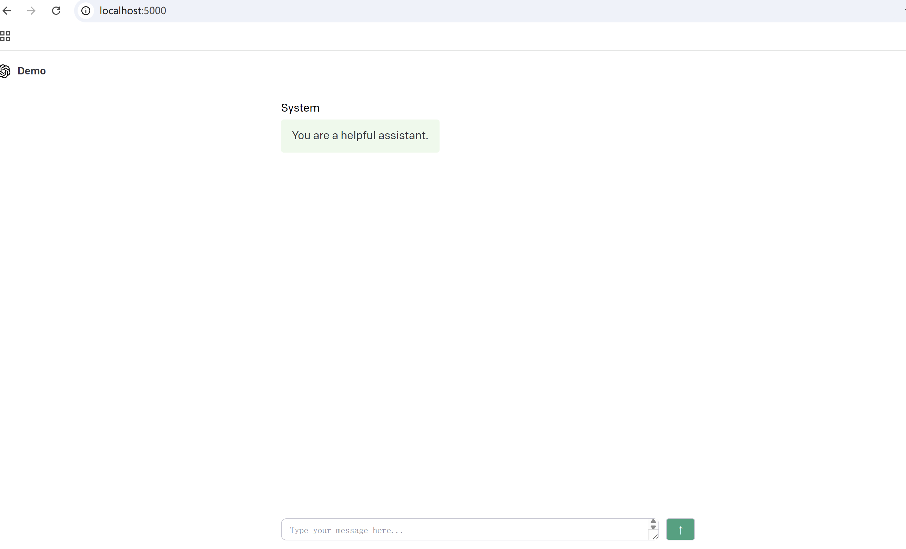

# Summary 
This project is a copy of the openai project 
`git clone https://github.com/openai/openai-quickstart-python.git`

# Process for setting up this project 

- Follow the instructions in README.md
- You should install python 3.11, otherwise there will be an error like this:
```
cargo:rerun-if-changed=python/pydantic_core/core_schema.py
    cargo:rerun-if-changed=generate_self_schema.py

        --- stderr
        Traceback (most recent call last):
          File "C:\Users\chenj\AppData\Local\Temp\pip-install-upvc5web\pydantic-core_5adfe859297a4bb991e1f721545d9727\generate_self_schema.py", line 192, in eval_forward_ref
            return type_._evaluate(core_schema.__dict__, None, set())
                   ~~~~~~~~~~~~~~~^^^^^^^^^^^^^^^^^^^^^^^^^^^^^^^^^^^
        TypeError: ForwardRef._evaluate() missing 1 required keyword-only argument: 'recursive_guard'

        During handling of the above exception, another exception occurred:

        Traceback (most recent call last):
          File "C:\Users\chenj\AppData\Local\Temp\pip-install-upvc5web\pydantic-core_5adfe859297a4bb991e1f721545d9727\generate_self_schema.py", line 240, in <module>
            main()
            ~~~~^^
          File "C:\Users\chenj\AppData\Local\Temp\pip-install-upvc5web\pydantic-core_5adfe859297a4bb991e1f721545d9727\generate_self_schema.py", line 210, in main
            value = get_schema(s, definitions)
          File "C:\Users\chenj\AppData\Local\Temp\pip-install-upvc5web\pydantic-core_5adfe859297a4bb991e1f721545d9727\generate_self_schema.py", line 54, in get_schema
            return type_dict_schema(obj, definitions)
          File "C:\Users\chenj\AppData\Local\Temp\pip-install-upvc5web\pydantic-core_5adfe859297a4bb991e1f721545d9727\generate_self_schema.py", line 152, in type_dict_schema
            field_type = eval_forward_ref(field_type)
          File "C:\Users\chenj\AppData\Local\Temp\pip-install-upvc5web\pydantic-core_5adfe859297a4bb991e1f721545d9727\generate_self_schema.py", line 195, in eval_forward_ref
            return type_._evaluate(core_schema.__dict__, None)
                   ~~~~~~~~~~~~~~~^^^^^^^^^^^^^^^^^^^^^^^^^^^^
        TypeError: ForwardRef._evaluate() missing 1 required keyword-only argument: 'recursive_guard'

        thread 'main' panicked at build.rs:29:9:
        generate_self_schema.py failed with exit code: 1
        note: run with `RUST_BACKTRACE=1` environment variable to display a backtrace
      warning: build failed, waiting for other jobs to finish...
       maturin failed
        Caused by: Failed to build a native library through cargo
        Caused by: Cargo build finished with "exit code: 101": `"cargo" "rustc" "--features" "pyo3/extension-module" "--message-format" "json-render-diagnostics" "--manifest-path" "C:\\Users\\chenj\\AppData\\Local\\Temp\\pip-install-upvc5web\\pydantic-core_5adfe859297a4bb991e1f721545d9727\\Cargo.toml" "--release" "--lib" "--crate-type" "cdylib"`
      Error: command ['maturin', 'pep517', 'build-wheel', '-i', 'C:\\Users\\chenj\\AppData\\Local\\Programs\\Python\\Python313\\python.exe', '--compatibility', 'off'] returned non-zero exit status 1
      [end of output]

  note: This error originates from a subprocess, and is likely not a problem with pip.
  ERROR: Failed building wheel for pydantic_core
Successfully built MarkupSafe
Failed to build pydantic_core
ERROR: Failed to build installable wheels for some pyproject.toml based projects (pydantic_core)


```
The error you encountered occurred during the installation of `pydantic_core`, where the Rust compilation process failed, mainly due to: `ForwardRef._evaluate()` is missing the parameter `recursive_guard`, which caused a TypeError.

When the installation finished, you can check the version of python you are using: `py -0`

- Create the virtual environment using python3.11
```
bash

py -3.11 -m venv venv311
.\venv311\Scripts\activate
python --version


```

- You need to update some of the code in the `app.py` and make sure it could access the `OPENAI_API_KEY`
```
from dotenv import load_dotenv
import os
import openai

load_dotenv()
client = openai.OpenAI(api_key=os.getenv("OPENAI_API_KEY"))

```

- when you run the project, for example you want to practice the chat-basic example 
```
cd .\examples\chat-basic\
flask run
 * Running on http://127.0.0.1:5000

```
The UI will be look like this:
